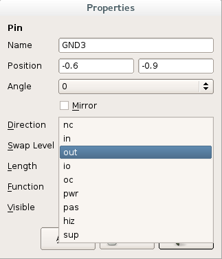
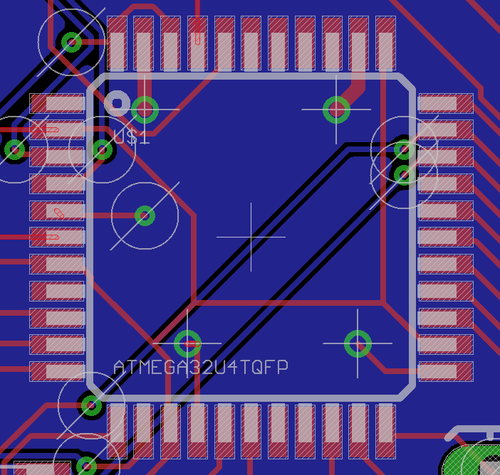

# Prototyping

## Perfboard and stripboard

### Links

 - [Prototyping Circuits with stripboards](http://www.societyofrobots.com/member_tutorials/node/90)

## PCB

A good rule-of-thumb for a two-layer board is to route only horizontally on one layer and only vertically on the other

### Units of measure

In electronics are used commonly the imperial units, the normal spacing distance is usually 0.1 inch (i.e. 2.54mm);
a [thousandth of an inch](http://en.wikipedia.org/wiki/Thousandth_of_an_inch) is named as **mil**, and is used all over
the place.

### Text

The text goes on the silkscreen, represented by the two layers ``tPlace`` and ``bPlace`` (respectively
layer 21 and 22)

### Dimensions

The PCB size is determined from the outline of the layer 20.

### Creating a new part

Eagle requires three things to get an IC into the library:

* Package (also known as a footprint)
* Symbol (the schematic symbol)
* Device (mapping them together)

It's possible to indicate in the symbol section what use have the various pins, simply open the info
window for the pin and then select the correct indication in the ``direction`` section

### Placing elements

Once an element is added to the schematics it's placed also on the board window and it's possible
to move around.

Probably the label and value of the element will be placed in a position that is not correct, to correct
that is possible to use the ``smash`` action from the contextual menu: this will de-connect the label and the
value that can be moved and edited separately.

### Tracing

You can use a trick to hide the ``GND`` wires: select with the ``info`` tool the wire and
then check the box **Airwires hidden**.

Some chips have ``GND`` and ``VCC`` pins distribuited randomly along the sides and can be difficultous to be
able to route all of them, so it's possible to route to the ``GND`` using [vias connected directly to the a ``GND``](http://cmosedu.com/jbaker/students/kendrick/ViasGND/ViasGND.htm)
plane; below an image showing an example with an ``ATMEGA32U4`` chip

### Links

 - [Tutorial](https://learn.sparkfun.com/tutorials/designing-pcbs-advanced-smd) by Sparkfun with a lot of info about manually routing
 - [Guide](http://www.alternatezone.com/electronics/files/PCBDesignTutorialRevA.pdf) PCB Design Tutorial
 - [Video](https://www.youtube.com/watch?v=NJKZZArjdg8) SparkFun According to Pete #34: PCB Layout
 - Eagle [Tips and Tricks](http://dangerousprototypes.com/docs/Cadsoft_Eagle_tips_and_tricks) by Dangerous Prototypes
 - http://www.learnemc.com/tutorials/PCB_Layout/PCB_Layout.html
 - http://www.gerber-viewer.com/
 - http://fritzing.org
 - http://www.seeedstudio.com/depot/fusion-pcb-service-p-835.html
 - http://be.eurocircuits.com/basic/try-pcb-visualizer.aspx#
 - https://www.olimex.com/PCB/
 - http://www.instructables.com/id/How-to-reverse-engineer-a-schematic-from-a-circuit/?ALLSTEPS
 - http://pcbshopper.com/
 - https://learn.sparkfun.com/tutorials/using-eagle-board-layout
 - https://github.com/civanovici/roduino/tree/master/eagle
 - http://michaelhleonard.com/how-to-design-the-perfect-pcb-part2/
 - Getting Started with CadSoft EAGLE [video](https://www.youtube.com/watch?v=R4DYztYB6d4)
 - How To Easily Find PCB Tracks: [video](https://www.youtube.com/watch?v=oyedFq1VAjg)
 - http://www.robotroom.com/PCB-Layout-Tips.html
 - http://www.cadsoftusa.com/downloads/libraries
 - [Better PCBs in Eagle](https://www.sparkfun.com/tutorials/115)
 - [Guideline](http://support.seeedstudio.com/knowledgebase/articles/422482-fusion-pcb-order-submission-guidelines) to PCB submission for Seed Studio (DRU file).
 - http://diy.viktak.com/2013/02/tutorial-panelizing-pcbs-in-eagle.html
 - Add a Logo to Your PCB with eagle [video](https://www.youtube.com/watch?v=z1Ej3nJz43c)
 - Creating a part on Eagle: [tutorial](https://learn.sparkfun.com/tutorials/designing-pcbs-smd-footprints) by Sparkfun
