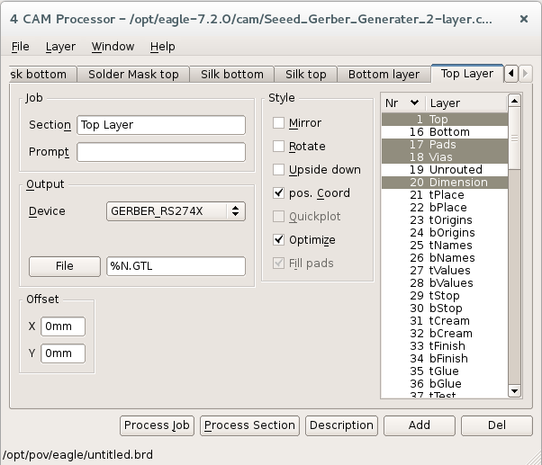

# Prototyping

Prototyping is the process of designing and building a device
with trial and error to approximate the needed functionality
and deal with real life issues.

In this page mainly we are talking about PCB but it's also related
to 3d printing and other way to prototype devices.

## Examples

 - [Building a retro split-flap display](https://imgur.com/a/0VAMZ)

## General notes

There are several aspects of a board to take into account when is designed

### Logic Levels

Probably your board contains a chip that is going to accept only some values
as voltage for communicating with the external world, since we want to be as
safe as possible is advisable to use a [logic level shifter](cookbook.md#logic-level-converter)
for each signal line that is accessible from the pinout.

### Power supply

Usually the logic levels are related to the voltage accepted from the main
component of the board: in order to be more versatile when designing your
device use a simple [voltage regulator](voltagereg#linear) (with the lowest possible dropout) to
supply the board with the correct value.

Indicate on the back of the board the acceptable value for the input voltage that
is mainly conseguence of the electrical characteristic of the voltage regulator.

### Pinout

Expose the power lines (``GND``, ``VIN`` and ``VOUT`` if there is a voltage
regulator) and to made accessible all the input/output signals that are necessary in order
to use correctly the device.

Group them based on type (``SPI``, ``I2C``, etc...) along with the
their own power line for their logic level.

For some boolean input is possible to use a switch
with clear indication near it of their scope.

Use testpad to expose signal lines.

Make them with an appropriate spacing so that can be used with a breadboard.

### Mounting holes

Probably the device will be mounted in a case or will be fixed to something,
so it's necessary to place some hole (maybe grounded).

My advice is to place the holes before starting placing components around.

Some more info in this [link](https://blogs.mentor.com/tom-hausherr/blog/tag/pcb-mounting-holes/).

### Paper prototyping

It's easy to lose the real proportion of the various parts, so,
before sending in production the physical board, print it on paper in order
to test if the components fit into the layout, if all the text is visible,
readable, and if it's all confortable to solder. Check from the ``CAM`` what
layer you export; in a SeeedStudio gerber file the following script we show
all the needed for top and bottom of the board (remember to print the back
with the ``mirror`` option enabled)

```
display none 20 31 21 25 1 17 18 29;
display none 20 22 26 16 17 18;
```
(have been removed the solder mask and paste for better printability).


## Perfboard and stripboard

### Links

 - [Prototyping Circuits with stripboards](http://www.societyofrobots.com/member_tutorials/node/90)

## PCB

Printed circuit boards are de-facto standard for electronic circuit production.

A good rule-of-thumb for a two-layer board is to route only horizontally on one layer and only vertically on the other

### Units of measure

In electronics are used commonly the imperial units, the normal spacing distance is usually 0.1 inch (i.e. 2.54mm);
a [thousandth of an inch](http://en.wikipedia.org/wiki/Thousandth_of_an_inch) is named as **mil**, and is used all over
the place.

### Layers

A PCB is made of a series of different layers

 - Copper: defines the traces and the same voltage stuffs; it's where you place the solder
 - Soldermask: gives to the PCB its green color, it avoids contacts between traces and between external
   stuffs and the copper layers
 - Silkscreen: contains the drawings with components labelling and artwork

### Panelization

The boards are not builded one at times, they are usually done in an unique sheet, the single
board are separated lately;

Exist some programs to merge gerber files together

* [Gerbmerge](http://174.136.57.11/~ruggedci/gerbmerge/): A Gerber-file merging program,
[here](http://www.instructables.com/id/Panelizing-PCBs-for-Seeed-Using-Eagle-Free-Light/?ALLSTEPS) a instructables that explains

### BOM

It's possible to generate the **Bill of material** tiping ``run bom.ulp`` in the
console of eagle from the schematic view.

 - http://www.cs.uml.edu/teams-academy/index.php/AT/Bom

### CAM

In order to export the files necessary to manifacture a PCB you need the ``CAM`` file from
the manifacturer, load it from the ``File`` menu and then click ``Process job``; when the
processing has finished than you will found the created files in the folder.



### Stencil

If your PCB has SMD components, it's a good idea to produce a stencil in order to help to place the
solder paste correctly. In Eagle this is accomplished exporting the ``tCream`` or ``bCream`` layer.

 - https://www.sparkfun.com/tutorials/383
 - http://blinkinlabs.com/blog/2014/08/tutorial-solder-stencil/
 - [OSHStencils.com](https://www.oshstencils.com)

## Fab

Exist several different services that offer PCB production

 - [https://macrofab.com](MacroFab)
 - [Seeed Studio](http://www.seeedstudio.com/service/index.php?r=pcb)
 - [Elecfreaks](http://www.elecfreaks.com/estore/pcb-service)
 - [jlcpcb](https://jlcpcb.com/)
 - [PCBWay](https://www.pcbway.com)

but it's possible also to DIY one with chemicals as described [here](https://ultrakeet.com.au/write-ups/makepcbs).

### Links


 - [Debugging your pcb](http://aa-pcbassembly.com/about_pcb_assembly/debugging-your-pcb/)
 - [Tutorial](https://learn.sparkfun.com/tutorials/designing-pcbs-advanced-smd) by Sparkfun with a lot of info about manually routing
 - [Guide](http://www.alternatezone.com/electronics/files/PCBDesignTutorialRevA.pdf) PCB Design Tutorial
 - [Video](https://www.youtube.com/watch?v=NJKZZArjdg8) SparkFun According to Pete #34: PCB Layout
 - Eagle [Tips and Tricks](http://dangerousprototypes.com/docs/Cadsoft_Eagle_tips_and_tricks) by Dangerous Prototypes
 - [Post](http://www.learnemc.com/tutorials/PCB_Layout/PCB_Layout.html) about designing PCB with high frequency problems in mind.
 - http://www.gerber-viewer.com/
 - http://fritzing.org
 - http://mayhewlabs.com/webGerber/
 - http://www.seeedstudio.com/depot/fusion-pcb-service-p-835.html
 - http://be.eurocircuits.com/basic/try-pcb-visualizer.aspx#
 - https://www.olimex.com/PCB/
 - http://www.instructables.com/id/How-to-reverse-engineer-a-schematic-from-a-circuit/?ALLSTEPS
 - http://pcbshopper.com/
 - https://learn.sparkfun.com/tutorials/using-eagle-board-layout
 - https://github.com/civanovici/roduino/tree/master/eagle
 - http://michaelhleonard.com/how-to-design-the-perfect-pcb-part2/
 - Getting Started with CadSoft EAGLE [video](https://www.youtube.com/watch?v=R4DYztYB6d4)
 - How To Easily Find PCB Tracks: [video](https://www.youtube.com/watch?v=oyedFq1VAjg)
 - [Neat tips](http://www.robotroom.com/PCB-Layout-Tips.html) about layouts allowing multiple kind of the same component, traces and soldermask
 - http://www.cadsoftusa.com/downloads/libraries
 - [Better PCBs in Eagle](https://www.sparkfun.com/tutorials/115)
 - [Guideline](http://support.seeedstudio.com/knowledgebase/articles/422482-fusion-pcb-order-submission-guidelines) to PCB submission for Seed Studio (DRU file).
 - http://diy.viktak.com/2013/02/tutorial-panelizing-pcbs-in-eagle.html
 - Add a Logo to Your PCB with eagle [video](https://www.youtube.com/watch?v=z1Ej3nJz43c)
 - Creating a part on Eagle: [tutorial](https://learn.sparkfun.com/tutorials/designing-pcbs-smd-footprints) by Sparkfun
 - http://www.baconfatlabs.com/2011/11/oshw-eagle-symbols-for-schematic-and-silkscreen/
 - https://learn.adafruit.com/eagle-tutorial-how-to-add-a-new-package-to-a-component/new-package
 - http://electronics.stackexchange.com/questions/16398/find-short-location-on-pcb
 - http://electronics.stackexchange.com/questions/55710/how-do-i-change-the-properties-of-several-objects-at-once
 - [Vias as test points](http://electronics.stackexchange.com/questions/48557/testpoints-vias-versus-pads)
 - [Instructables](http://www.instructables.com/id/Make-hobbyist-PCBs-with-professional-CAD-tools-by-/?ALLSTEPS) about modifing Design rules of Eagle for hobbystic design
 - Tips on how to properly design/layout a Printed Circuit Board (PCB) [page](http://www.onmyphd.com/?p=pcb.design)
 - https://learn.adafruit.com/downloads/pdf/ktowns-ultimate-creating-parts-in-eagle-tutorial.pdf
 - http://kb.gr8bit.ru/KB0015/GR8BIT-KB0015-Best-practices-creating-designs-with-EAGLE.html
 - https://github.com/lachlanA/eagle-to-kicad
 - https://github.com/electroniceel/protoboard

## 3D

### Printer

The /poor man/ 3d printer uses the technology called **FDM**, i.e. **Fused deposition modeling**

 - [FDM on wikipedia](https://en.wikipedia.org/wiki/Fused_deposition_modeling)
 - [Rafts, skirts and brims](https://www.simplify3d.com/support/articles/rafts-skirts-and-brims/)
 - [Troubleshooting Guide to 22 Common 3D Printing Problems](https://all3dp.com/common-3d-printing-problems-3d-printer-troubleshooting-guide/)
 - [Print Quality Troubleshooting Guide](https://www.simplify3d.com/support/print-quality-troubleshooting/)
 - [A visual Ultimaker troubleshooting guide](http://support.3dverkstan.se/article/23-a-visual-ultimaker-troubleshooting-guide)
 - [changing filament](https://www.thingiverse.com/groups/prusa-i3/topic:6734)
 - [changing filament midprint](https://www.thingiverse.com/groups/i3/topic:5963)

### Freecad

[Home Page](http://freecadweb.org)

#### Links

- [BOLTS](https://boltsparts.github.io/en/index.html) is an Open Library of Technical Specifications.

## Enclosure box

 - [How To Make Nice Looking DIY Front Panel](http://jumperone.com/2013/01/how-to-make-diy-front-panel/)
