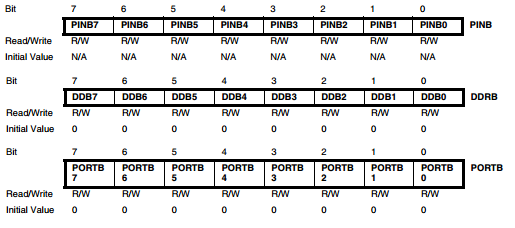
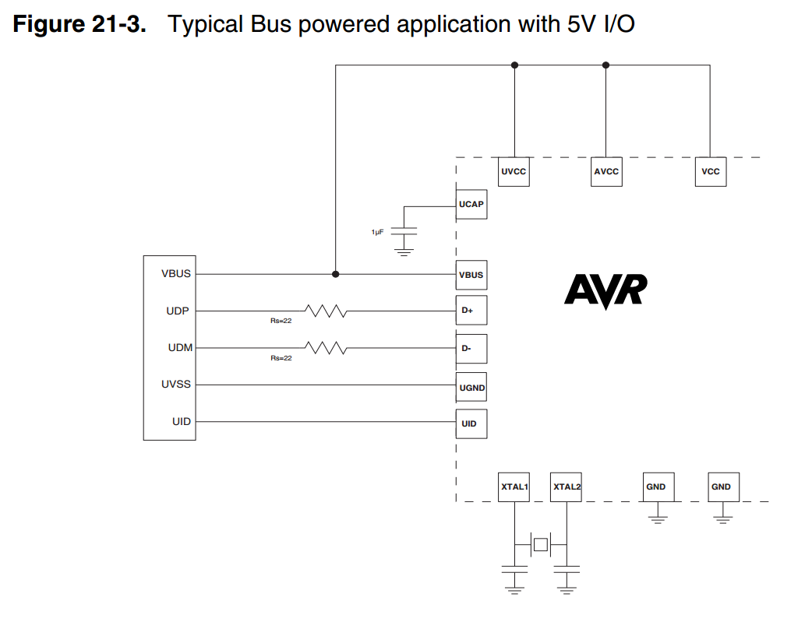
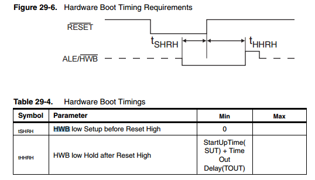

**AVR** is a modified Harvard 8-bit RISC single chip microcontroller [(instruction set)](http://www.atmel.com/Images/doc0856.pdf).

 - [AVR040: EMC Design Considerations](http://www.atmel.com/images/doc1619.pdf)
 - [AVR042: AVR Hardware Design Considerations](http://www.atmel.com/images/atmel-2521-avr-hardware-design-considerations_applicationnote_avr042.pdf)

The advice is to read the datasheets that contain a lot of info and working examples, for example
the [ATMEGA32U4](https://www.pjrc.com/teensy/atmega32u4.pdf) one.

Some weird naming is going on, for example, ``ATMega32u4-AU`` means use external clock, instead
``ATMega32u4-RC`` uses internal clock or ``-AUR`` meaning [reel](https://www.avrfreaks.net/forum/difference-between-atmega32u4-au-and-atmega32u4-aur).

## Memory

This kind of microcontrollers have three types of (linear) memory

 - flash: contains the code
 - SRAM: contains the running data (registers, I/O, RAM)
 - EEPROM: contains the static data (not present in all the chips)

The program flash memory space is divided in two sections, the **Boot Program** section and
the **Application Program** section; each one has dedicated **lock** bits for write and read/write
protection.

## Clocks

Each subsystem of an AVR chip has its own clock that is possible to deactivate in order to reduce power consumption.

If you use an external oscillator take in mind that you need a specific value
of capacitor to associate with (read the related section, for an ``ATMega32U4`` is ``12-22pF``).

 - [ Best Practices for the PCB layout of Oscillators](http://www.atmel.com/Images/doc8128.pdf)

## Fuses

The **fuses** are special memory spaces that can be modified only by a programmer and
that decides certain configuration with which the chip will run.

**Note:** some modification to these values can brick the chip, so use caution!

 - Some indication about [FUSE settings](http://coding.zencoffee.org/2011/08/aeroquad-251-code-upload-via-icsp.html): in particular

    What's notable is that the default fuse setup for an Arduino (here)
    will set the high fuse to 0xD6.  This sets up the Arduino so on boot
    it will boot the bootloader.  In other words, code execution will not
    begin at address 0x0000.  This won't work if you have no bootloader.
    The fuses need to be changed so that the BOOTRST flag is unprogrammed.
    In AVR-speak, this means it's set to a value of 1 (0 means "programmed).
    So, this means that the high fuse needs to be set to 0xD7.  No other
    fuses need to be changed.

### Links

 - [Fuse calculator](http://www.frank-zhao.com/fusecalc/fusecalc.php?chip=atmega328p)
 - [Engbedded Atmel AVR® Fuse Calculator](http://www.engbedded.com/fusecalc/)

## Sleep modes

## Interrupts

## I/O

Three I/O memory address locations are allocated for each port

* Data Direction Register – DDRx: decides if that pin is input (logic zero) or output (logic 1)
* the Data Register – PORTx: in output mode decides the logic level, in input mode decides if the pull-up resistor is activated
* Port Input Pins – PINx: when the pin is in input mode, you can read from this register the logic value.

The Port Input Pins I/O location is read only, while the Data Register and the Data Direction Register are read/write.

The ports are bi-directional I/O ports with optional internal pull-ups



If some pins are unused, it is recommended to ensure that these pins have a defined level, floating inputs should be avoided to
reduce current consumption in all other modes where the digital inputs are enabled (Reset, Active mode and Idle
mode).
The simplest method to ensure a defined level of an unused pin, is to enable the internal pull-up. In this case, the
pull-up will be disabled during reset. If low power consumption during reset is important, it is recommended to use
an external pull-up or pulldown. Connecting unused pins directly to VCC or GND is not recommended, since this
may cause excessive currents if the pin is accidentally configured as an output.

### Links

 - How do I pass an IO port as a parameter to a function? [FAQ](http://www.nongnu.org/avr-libc/user-manual/FAQ.html#faq_port_pass)

## ADC

The ADC converts an analog input voltage to a 10-bit digital value through successive approximation. The minimum
value represents GND and the maximum value represents the voltage on VCC, the voltage on the AREF pin
or an internal 1.1V / 2.56V voltage reference.

 - http://nicecircuits.com/playing-with-analog-to-digital-converter-on-arduino-due/
 - [Tutorial](http://maxembedded.com/2011/06/the-adc-of-the-avr/) about the ``ADC``

## USI/SPI

This is the way to do serial communication with an atmel chip, it allows to
create three and two wire communication (SPI is a three wire with a slave select
channel implemented via software).

In the Attiny family there is the USI way, in the ATmega there is a SPI implementation.

 - Using the USI module for SPI communication [PDF](http://www.atmel.com/images/doc2582.pdf)
 - [SPI](http://maxembedded.com/2013/11/the-spi-of-the-avr/)
 - Half duplex UART using the USI module [PDF](http://www.atmel.com/Images/doc4300.pdf)

## USB

Some chips have USB builtin



 - [LUFA](http://www.fourwalledcubicle.com/LUFA.php): open-source complete USB stack for the USB-enabled Atmel AVR8 and (some of the) AVR32 microcontroller series,

## Reset pin

It's possible to reset the chip presenting a low level on the ``RESET`` pin for longer than the minimum pulse length.
So, in order to not have a continuous reset, you need to pull up the ``RESET`` pin; generally if in your circuit you need
to reset the chip, a temporary switch is used


In parallel programming mode is possible to use 12V with this pin (it's the only one with which this is possible).

## Programming

You must put the code into the chip in order to do something and in this section will explained
how this is possible.

More info [here](http://www.avrfreaks.net/forum/tut-hard-avr-programming-methods?page=all) and [here](http://en.wikibooks.org/wiki/Embedded_Systems/Atmel_AVR#Programming_Interfaces)
and [here](http://www.avrfreaks.net/forum/tutsoft-recovering-locked-out-avr).

### In-system Programming

It's possible to program the non-volatile memory directly on-board using the **in-system programming**[(reference)](http://www.atmel.com/images/doc0943.pdf):
it's a 3-wire SPI interface.

A client to use is ``avrdude``, capable of using several hardware interface in order to program
the chip (in the example below is indicated with the ``-c`` option):

```
$ avrdude -c buspirate
avrdude: No AVR part has been specified, use "-p Part"

Valid parts are:
  uc3a0512 = AT32UC3A0512
  c128     = AT90CAN128
  c32      = AT90CAN32
  c64      = AT90CAN64
  pwm2     = AT90PWM2
  pwm2b    = AT90PWM2B
  pwm3     = AT90PWM3
...
  m328     = ATmega328
  m328p    = ATmega328P
...
  x64a4    = ATxmega64A4
  x64a4u   = ATxmega64A4U
  x64b1    = ATxmega64B1
  x64b3    = ATxmega64B3
  x64c3    = ATxmega64C3
  x64d3    = ATxmega64D3
  x64d4    = ATxmega64D4
  x8e5     = ATxmega8E5
  ucr2     = deprecated, use 'uc3a0512'
```

```
$ avrdude -c buspirate -p m328p -v -P /dev/ttyUSB0
```

### High Voltage Serial Programming

AKA ``HVSP``

 - http://www.simpleavr.com/avr/hvsp-fuse-resetter

### Bootloader

In some chips is possible to use a bootloader to update the firmware; the bootloader resides at a special
section of memory and using some serial protocol does its job.

A particolar type is the **DFU bootloader** that you can found pre-flashed in some Atmel chips:
the [documentation](http://www.atmel.com/Images/doc7618.pdf) describes it as

    This USB bootloader allows to perform In-System Programming from an USB
    host controller without removing the part from the system or without a
    pre-programmed application, and without any external programming interface.

It's possible to burn a firmware using the [dfu-programmer](https://dfu-programmer.github.io/).

The pin ``PE2/HWB`` is a special pin that has a special function: if the fuse ``HWBE`` is enabled, during reset
this pin is sampled and the bootloader is started instead of the application code: from the atmel's documentation



### File Format

It's possible to converto an hex file to object using this line

    $ avr-objdump -j .sec1 -d -m avr5 <hex file>

Links
-----

 - [AVR Beginners](http://www.avrbeginners.net/)
 - http://www.build-electronic-circuits.com/microcontroller-tutorial-part1/
 - [AVR selector](http://www.atmel.com/v2pfresults.aspx)
 - [Write bootloader for AVR](http://www.engineersgarage.com/embedded/avr-microcontroller-projects/How-To-Write-a-Simple-Bootloader-For-AVR-In-C-language)
 - http://blog.schicks.net/wp-content/uploads/2009/09/bootloader_faq.pdf
 - http://www.fischl.de/avrusbboot/
 - [Atmel AVR Dragon (ATAVRDRAGON)](http://store.atmel.com/PartDetail.aspx?q=p:10500053#tc:description) and how [use](http://www.larsen-b.com/Article/315.html) it on linux
 - [A Quickstart Tutorial for ATMEL AVR Microcontrollers](http://imakeprojects.com/Projects/avr-tutorial/)
 - Getting [started](http://www.evilmadscientist.com/2007/resources-for-getting-started-with-avrs/) with AVR.
 - Simple [AVR guide](https://sites.google.com/site/qeewiki/books/avr-guide)
 - Some indications on [AVR programming](http://hlt.media.mit.edu/wiki/pmwiki.php?n=Main.AVRProgrammingAdvanced)
 - ATMega328 [datasheet](http://www.atmel.com/Images/doc8161.pdf)
 - http://forums.trossenrobotics.com/tutorials/introduction-129/avr-basics-3261/
 - http://www.nongnu.org/avr-libc/
 - [RIFF-WAVE format files in LPCM player using attiny85](http://elm-chan.org/works/sd8p/report.html)
 - [Using Arduino as ISP programmer](http://hlt.media.mit.edu/?p=1706) (also from [arduino](http://arduino.cc/en/Tutorial/ArduinoISP) site)
 - AVR [fuse](http://www.ladyada.net/learn/avr/fuses.html) by ladyada
 - Type of [memory](http://www.arduino.cc/playground/Learning/Memory) available.
 - [Example](http://www.scienceprog.com/atmega-eeprom-memory-writing/) of EEPROM code.
 - [PROGMEM](http://www.arduino.cc/en/Reference/PROGMEM), [EEMEM](http://tinkerlog.com/2007/06/16/using-progmem-and-eemem-with-avrs/) variable modifier.
 - [VGa](http://tinyvga.com/avr-vga) with the AVR.
 - I2C with [avr](http://www.embedds.com/programming-avr-i2c-interface/)
 - I2C for [attiny85](http://www.arduino.cc/playground/Code/USIi2c)
 - Simple project for [POV](http://voltsandbytes.com/tinypov-yet-another-avr-pov-project/) with AVR
 - USB to serial communication with [AVR](http://www.evilmadscientist.com/2009/basics-serial-communication-with-avr-microcontrollers/)
 - [USART](https://sites.google.com/site/qeewiki/books/avr-guide/usart)
 - Tutorial from [Sparkfun](http://www.sparkfun.com/tutorials/104) about Serial communication, RS232, etc...
 - http://learn.adafruit.com/memories-of-an-arduino/you-know-you-have-a-memory-problem-when-dot-dot-dot
 - [Getting Extra Pins on ATtiny](http://www.technoblogy.com/show?LSE)
 - http://codeandlife.com/2012/01/22/avr-attiny-usb-tutorial-part-1/
 - [V-USB](http://www.obdev.at/products/vusb/index.html) simple library to implements USB devices with AVR chips
 - [USB PCB Business Card](http://www.instructables.com/id/USB-PCB-Business-Card/?ALLSTEPS)


ATTINY85
--------

 - [Datasheet](http://www.atmel.com/Images/Atmel-2586-AVR-8-bit-Microcontroller-ATtiny25-ATtiny45-ATtiny85_Datasheet.pdf)


|BusPirate    |ATtiny85  |
|-------------|----------|
|CS (white)   |RESET (1) |
|GND (brown)  |GND (4)   |
|MOSI (grey)  |MOSI (5)  |
|MISO (black) |MISO (6)  |
|CLK (purple) |SCK (7)   |
|+5V (orange) |Vcc (8)   |

## ATMega328p

 - [Datasheet](http://www.atmel.com/images/doc8161.pdf)


## Arduino

Pin 0 and 1 [are connected by 10k resistors to the serial hardware](http://forum.arduino.cc/index.php?topic=47654.0) so cannot be used.
