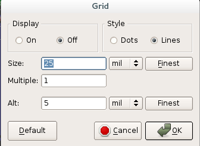
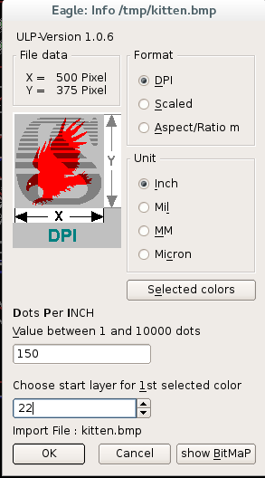

# Eagle

[Home page](http://www.cadsoftusa.com/) | [Download](http://www.cadsoftusa.com/download-eagle/)

## Grid

It's possible to configure a grid to use to snap elements to, it's also possible to move part in a finer way
holding down the ``Alt`` button (this make the part snap to the alternative grid)

## Text

The text goes on the silkscreen, represented by the two layers ``tPlace`` and ``bPlace`` (respectively
layer 21 and 22)

## Images

It's possible to import a ``BMP`` image file running ``run import-bmp.ulp`` from the console;
the image should have only two colors (probably you are converting from a different format, so
be aware of alpha channel, number of colors, etc...).

Import it using the dialog into the correct layer.

My advice is to create a new fake device with the image imported as package: in this way you can
move and do actions on it more easily.

## Dimensions

The PCB size is determined from the outline of the layer 20.

## Creating a new part

Eagle requires three things to get an IC into the library:

* Package (also known as a footprint)
* Symbol (the schematic symbol)
* Device (mapping them together)

It's possible to indicate in the symbol section what use have the various pins, simply open the info
window for the pin and then select the correct indication in the ``direction`` section

## Placing elements

Once an element is added to the schematics it's placed also on the board window and it's possible
to move around.

Probably the label and value of the element will be placed in a position that is not correct, to correct
that is possible to use the ``smash`` action from the contextual menu: this will de-connect the label and the
value that can be moved and edited separately.

## Tracing

You can use a trick to hide the ``GND`` wires: select with the ``info`` tool the wire and
then check the box **Airwires hidden**.

Some chips have ``GND`` and ``VCC`` pins distribuited randomly along the sides and can be difficultous to be
able to route all of them, so it's possible to route to the ``GND`` using [vias connected directly to the a ``GND``](http://cmosedu.com/jbaker/students/kendrick/ViasGND/ViasGND.htm)
plane; below an image showing an example with an ``ATMEGA32U4`` chip

In some cases you are not able to see where the missing airwires to route are, a [epic trick](https://blog.adafruit.com/2012/08/31/eagle-quicktip-finding-that-missing-airwire/)
is to zoom out a lot and then click to the routing tool, at this point the missing piece
will show magically.

There is also a zoomunrouted.ulp that zooms in on any place that is unconnected. It is a standard part of our PCB pre-flight.
