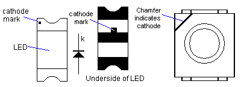

#Led

**N.B:** always double check that effectively the markings follow this
convention :)

## Links

 - [Resistor guide](http://www.resistorguide.com/resistor-for-led/)
 - [Sparkfun tutorial](https://learn.sparkfun.com/tutorials/light-emitting-diodes-leds)
