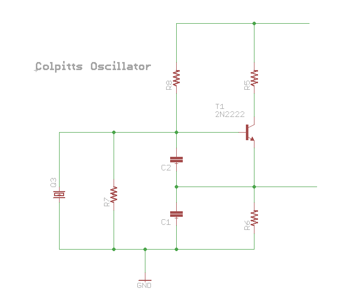

# Oscillator

Sometimes we need a timed signal to use as a clock (but also
for other things).

## General theory

The [Barkhausen stability criterion](https://en.wikipedia.org/wiki/Barkhausen_stability_criterion)
says that

 1. the loop gain exceeds unity at the resonant frequency
 2. the fase shift around the loop is $2\pi n$ (where $n\in N$)

bad enough seems that [the  Barkhausen Stability Criterion is simple, intuitive, and wrong](http://web.mit.edu/klund/www/weblatex/node4.html).

## RC

 - [Tutorial](http://www.electronics-tutorials.ws/oscillator/rc_oscillator.html)

## Crystal

Quartz is a piezoelectric material. When an electric
field is placed upon it, a physical displacement occurs.
Interestingly enough, we can write an equivalent electrical
circuit to represent the mechanical properties of
the crystal.

## Colpitts oscillator

 - [Video](https://www.youtube.com/watch?v=I4bAfDu6F1k) Colpitts Crystal Oscillator Fundamentals

## Negative resistance oscillator

Some active devices (like diode and transistor) have *zone* of **negative resistance** that can
be used to amplify the feedback loop of an oscillating circuit.

 - [Video](https://www.youtube.com/watch?v=rpGOKGrcpAk) World's Simplest Single Transistor Oscillator - BJT with Negative Resistance
 - [Page](https://www.st-andrews.ac.uk/~www_pa/Scots_Guide/RadCom/part5/page1.html) with a more elaborated explanation of NR.

### Links

 - Crystal Oscillator Basics and Crystal Selection for rfPICTM and PICmicro® Devices ([PDF](http://ww1.microchip.com/downloads/en/appnotes/00826a.pdf))
 - Crystal Oscillator Circuit Design ([PDF](http://www.eetkorea.com/ARTICLES/2001SEP/2001SEP06_AMD_AN.PDF))
 - Sparkfun [tutorial](https://www.sparkfun.com/tutorials/95)
 - Choosing the Right Crystal and Caps for your Design ([post](https://blog.adafruit.com/2012/01/24/choosing-the-right-crystal-and-caps-for-your-design/)
 - Microcontroller Oscillator Circuit Design Considerations ((PDF)[http://www.freescale.com/files/microcontrollers/doc/app_note/AN1706.pdf])
 - [Tutorial](http://www.electronics-tutorials.ws/oscillator/crystal.html) about crystals with pratical example of circuit using them.
 - [Video](https://www.youtube.com/watch?v=eYVOdlK15Og) with simple example of oscillators (with a little bit of oscilloscope)
