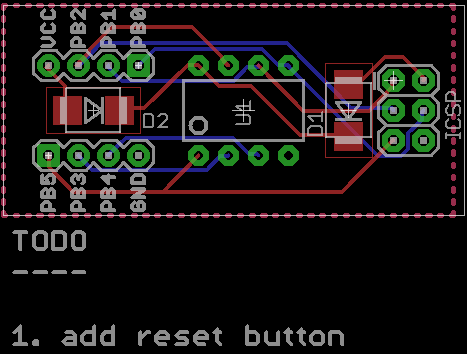

# Tiny Programmer

Inspired by [this](https://www.tindie.com/products/bot_thoughts/eezee-tiny-breakout-programming-board-kit/) programmer layout at Tindie.com I worked on a similar
concept

## TODO

 - Reset button
 - Decoupling capacitor
