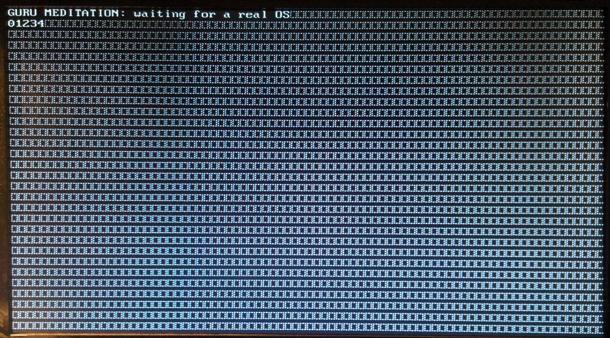

# VGA with Glyph

This is a variation over the standard VGA controller: we divide the screen into blocks
of 8x16 pixels to be rendered using predefined glyph. For now it uses the [BDF](https://en.wikipedia.org/wiki/Glyph_Bitmap_Distribution_Format) font
from the [Unicode VGA font](http://www.inp.nsk.su./~bolkhov/files/fonts/univga/)
burned into the ``ROM``. The text to display is taken from a Dual ``RAM``.

This is like the SVGA text mode (I guess).

**Note:** since ``ISE`` is shit (or I don't know better) it's not possible
to indicate a relative path for the glyph's ``ROM`` contents, so use the ``COREgen``
and select the right ``coe`` file.

## TODO

 - implement raster mode
