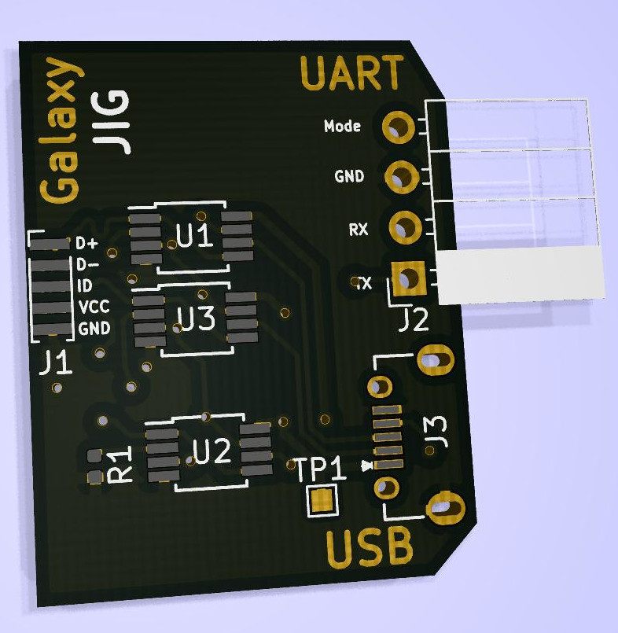

# Galaxy JIG

This is a board to easily develop on Samsung's smartphones that have the serial
port activated using a particular resistor value between the ``ID`` and ``GND``
of the ``USB`` connection.

To multiplex between the two possible routes I'm using the
[ADG723](https://www.analog.com/media/en/technical-documentation/data-sheets/adg721_722_723.pdf),
a STSP switch. and the ``mode`` signal as input for the mux.

## Soldering procedure

 1. solder the ``ADG723``
 2. check they are working correctly
 3. solder the ``USB`` connector
 4. build the micro ``USB`` cable and use it to check connectivity of the connector
 5. solder the ``USB`` cable
 6. solder the ``UART`` header
 7. solder the 619k resistor

## TODO

 - **rethink the switching interface**, probably I should use the [TS3USB221](https://www.ti.com/lit/ds/symlink/ts3usb221.pdf)
 - add also a variable resistor so to change the value easily
 - move test point to the ``UART HEADER`` so to expose ``VCC`` more easily
 - add labels indicating the signal passing through the switches
 - modify footprint ``USB`` micro connector to allow easier hand soldering
 - add two leds to indicate the mode
 - use a ``FTDI`` chip to directly talk serial over ``USB``

